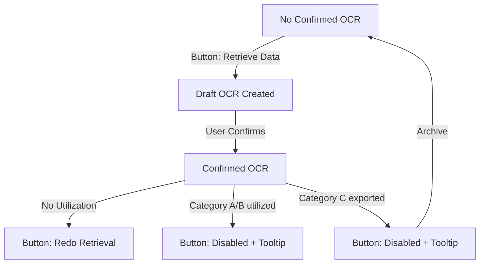

# Walkthrough - OCR UI Verification (v8.1)

I have verified that the OCR UI behavior matches the v8.1 rules, focusing on authoritative state enforcement and button state correctness.

## Changes and Improvements

### OCR UI State Machine
I verified the implementation of the OCR trigger button in `apps/web/app/task/[id]/page.tsx`. The button correctly cycles through the following states based on the attachment's OCR status and utilization:

1.  **Retrieve Data**: Shown when no confirmed OCR exists for the attachment.
2.  **Redo Retrieval**: Shown when a confirmed OCR exists but redo is permitted (Categories A/B utilization is null).
3.  **Disabled + Tooltip**: Shown when a confirmed OCR exists but redo is blocked due to active utilization (Category A/B records created or data exported).

### Authoritative Data Rule
I confirmed that the OCR Review page (`apps/web/app/attachments/[attachmentId]/review/page.tsx`) strictly follows the "authoritative data" rule. It only displays extraction results if a confirmed OCR output exists. Draft or unconfirmed results are not shown as authoritative records.

### Manual Actions
Verified that all state transitions and OCR triggers require explicit user intent.
- No background automation triggers OCR.
- The `useEffect` hooks strictly fetch state and do not initiate mutations.w

## Verification Results

### Evidence Review

I inspected the following components to confirm compliance:

- **Button Logic**: `apps/web/app/task/[id]/page.tsx` (line 1841) correctly uses `eligibility.hasConfirmed` and `eligibility.allowed` to determine label and state.
- **Data Derivation**: `apps/api/src/ocr/ocr.service.ts` (line 315) enforces the utilization-based blocking rules.
- **Authoritative Display**: `apps/web/app/attachments/[attachmentId]/review/page.tsx` correctly handles cases where confirmed OCR is missing by showing "No extraction available".

